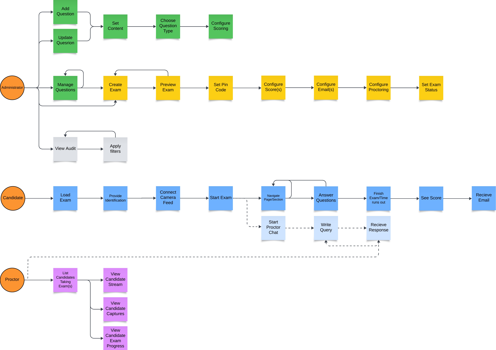
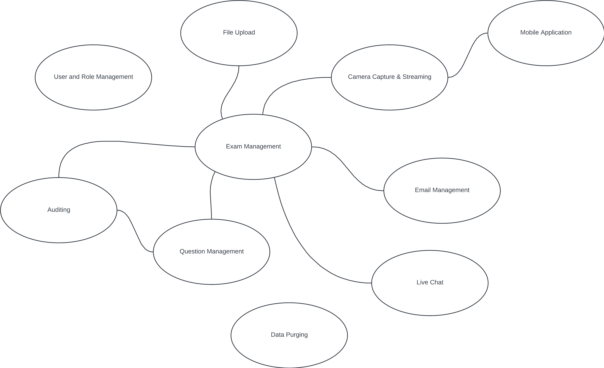
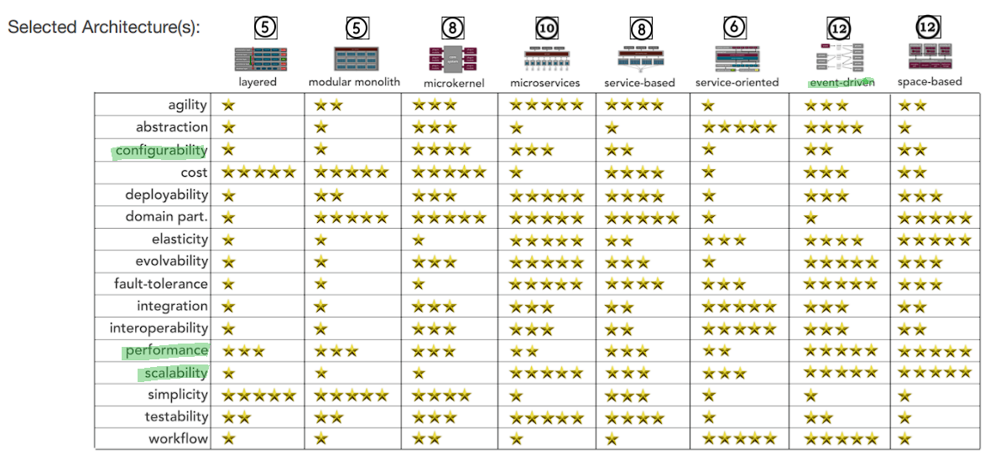
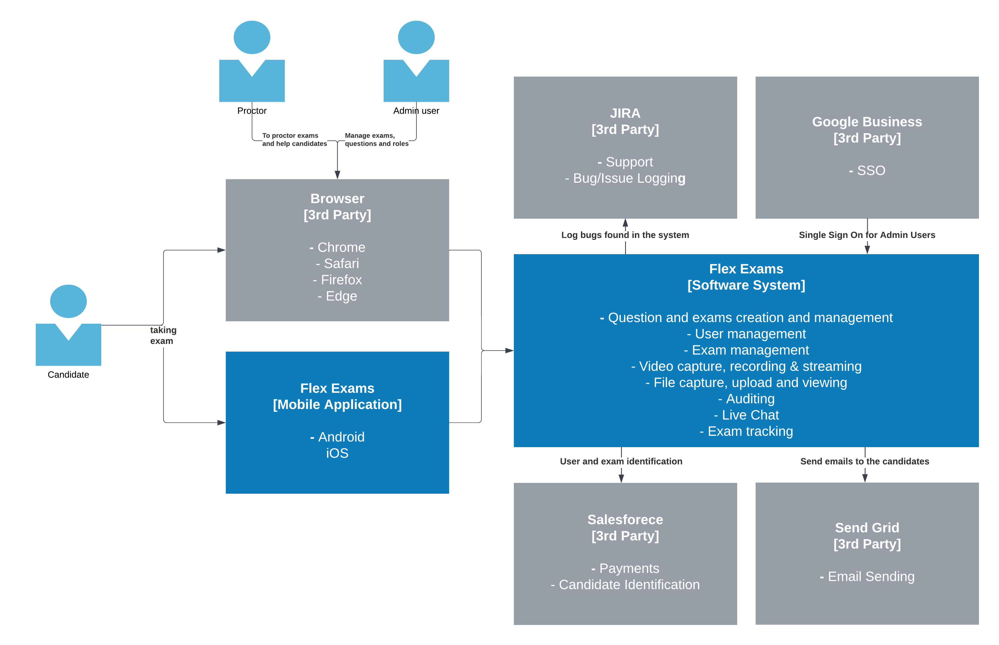
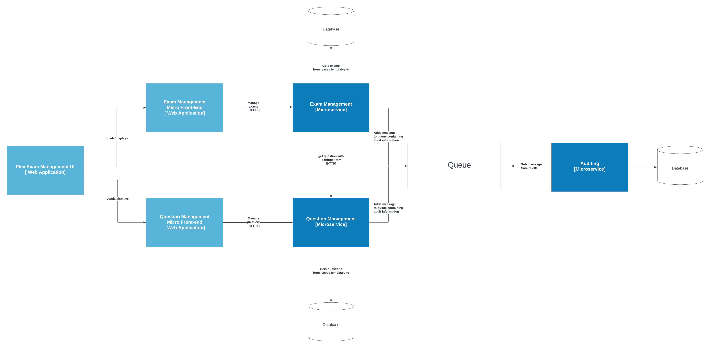
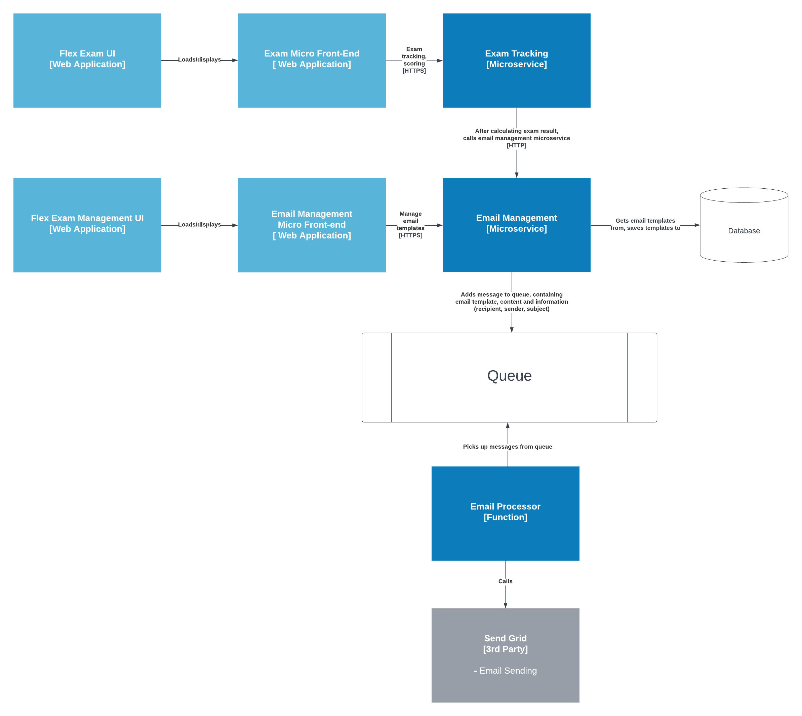
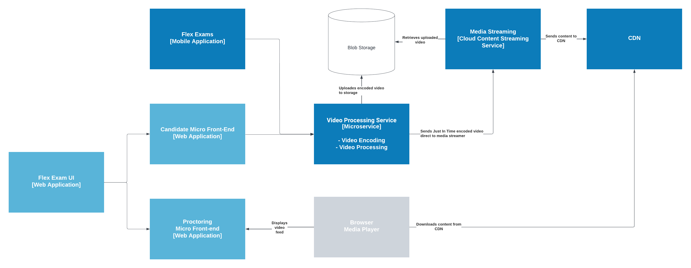
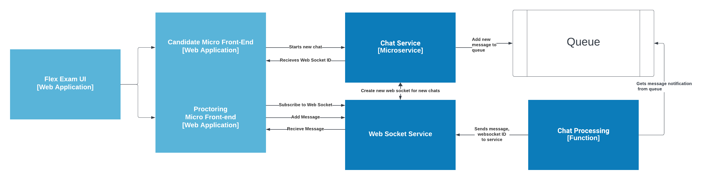
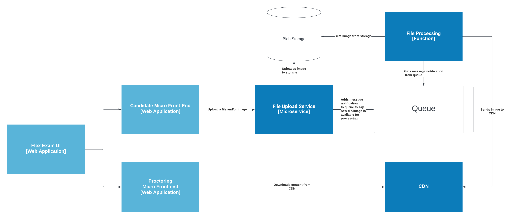
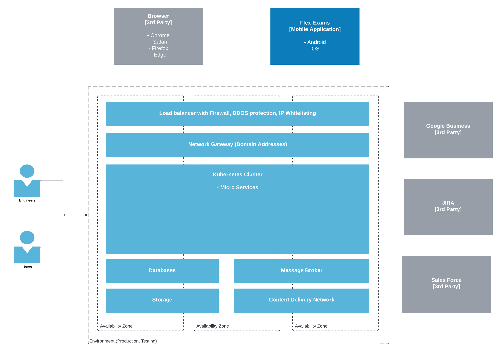

# OpenGI Katas - Flex Exams [Feb 2024]

## Contents
* [Business Case](#business-case)
* [Requirements](#requirements)
* [Architecture](#architecture)
   * [Workflows](#workflows)
   * [Context Map](#context-map)
   * [Characteristics](#characteristics)
   * [Architectural Style](#architectural-style)
   * [Architecture Decision Records](#architecture-decision-records)
   * [Architectural Principals](#architecture-principals)
   * [Architecture Diagrams](#architecture-diagrams)
   * [Deployment](#deployments)
   * [Technology](#technology)
* [Development plan](#development-plan)
  * [Development team](#development-teams)
  * [Milestones](#milestones)
* [Disaster Resovery](#disaster-recovery)
* [Costs](#costs)
 
## Business Context
SSS GmbH, a prominent certification body in Germany, conducts 30,000 exams annually across various sectors. They provide FLEX EXAMS for remote testing and collaborate with Pearson VUE for Test Center Exams. Challenges with the current third-party exam system, including downtime and slow support, prompt SSS to seek a new solution. The objective is an in-house, scalable online exam system aligning with SSS's vision for robust and customizable solutions. The goal is to enhance efficiency, reliability, and business diversification.
## Requirements

_For the original requirements, please see [here](./original_requirements/original_requirements.md)_

### Functional Requirements

- **User management**: for admin users to be able to manage other system administrators and roles
- **Exam management**: for administrators to be able to create exams and preview exams
- **Question management**: for administrators to be able to create and manage exam questions, set scores, score calculations
- **Audit trail**: track changes to data with the following information: Action (created, edited, deleted), Title, Modified By, Modified On. The trail will be available for searching by each of the columns.
- **Participant registration**: register the participant in the system, integrated with a client management system
- **Identity verification**: Allow for uploading of ID documents and video recording/photographing of candidates during the exam
- **Mobile application**: A mobile application, which use of the camera, for additional security and identity checks during the exam
- **Third party integrations**: Integrations with JIRA, Google Business and Salesforce.

### Non-functional requirements

- **Localization**: Ability to easily display multiple languages
- **Branding**: The look and feel of the system should be configurable according to brand guidelines and customers branding guidelines
- **Responsiveness**: Page load times should be under 2 seconds, 5 seconds will be considered acceptable
- **Performance**: The system should support 1000 users at any time, and there should be zero downtime.
- **Modularity**: The system should be easily upgraded in the future with minimal investment
- **GDPR**: The system should be fully compliant with GDPR
- **Support**: There should be 1st level, 24/7, support

## Architecture

### Workflows

During the requirements analysis phase, we identified some key work flows by different actors within the system. These work flows are how the actors interact with the system end to end in certain scenarios and helps us map the different components of the system.

### Context Map

During this phase we also identified the contexts, from the given requirements and the workflows mapped out. We have also mapped dependencies between domains. The relationships between the domains would then be defined in the MVP 1 (Project planning) stage. This will help us identify the required architecture, and the services within that architecture.

### Architectural Style

During the requirements analysis phase, we identified several architectural characteristics that are significant for the system. We grouped them into driving and implicit characteristics.

Driving and implicit characteristics are important to identify the most preferred architecture style or combination of them.

#### Driving characteristics

| Characteristic | Description |
|--|--|
| Performance | Performance is essential to provide a responsive and user friendly experience |
| Scalability | The system needs to be scalable, so that it can cope with large demand of circa 1000 users |
| Data Integrity | Data across the system must be kept correct, there must be no loss across the system to maintain integrity in the exam certificates issues. Data also includes sensitive information such as ID, so must be kept secure |
| Evolvability | The system will need to be open to new features and services to add new functionality without disrupting existing operations |

#### Implicit characteristics

| Characteristic | Description |
|--|--|
| Availability | The system must be available at all times, with 24/7 availability. The system will be multi-region meaning no downtime will be acceptable as the system must be accessable world-wide at all times |
| Changeability | The system needs to be easy to add to later on, as well as be easy to customise so that the branding of SSS can be used across the platform |
| Security | Parts of the system need to be secure and whitelisted to certain people only as well as keeping secure user data  |

#### Decision

The team picked three of the most important characteristics, Configurability, Performance and Scalability and came to the conclusion that an **event-driven architecture** would best suit the system. This would allow for features to be easily added, the system to be very scalable and to perform well.

### Architecture Decision Records

- [**ADR-1**](./adrs/1_architecture.md) - Use Event-Driven Microservices Architecture
- [**ADR-2**](./adrs/2_micro_frontends.md) - Use Micro Front-Ends for the Web Applications
- [**ADR-3**](./adrs/3_Message_Service.md)  - Use Message Service for Event Driven Architecture
- [**ADR-4**](./adrs/4_CDN.md) - Use Cloud Content Delivery Network
- [**ADR-5**](./adrs/5_Kubernetes.md) - Use Kubernetes to Deploy and Run Microservices

### Architectural Principals

- **Cloud native** - design the system  to take full advantage of the cloud. 
- **Design for scale** - when designing systems, think about scalability by breaking down components for flexible growth. Use scalable technologies and consider asynchronous design for better performance.
- **Automate everything** - prioritize automation by incorporating it seamlessly into the core design. Ensure the system is built with automation in mind from the beginning, covering automated builds, deployments, testing, monitoring, and alerting.
- **APIs are potential products** - develop APIs with the mindset of creating valuable products. Consider customer needs, emphasize user experience, and ensure ease of use, for external consumers and internal systems or developers.
- **Strategic Adaptability** - build adaptable solutions, balancing innovation with a careful consideration of potential dependencies, customizing the design to benefit from the chosen technology.
- **Zero-downtime deployments** - ensure smooth deployments with zero downtime. 
- **Secure by design** - prioritize security integration from the beginning. Incorporate security as a fundamental part of the development process.

### Architecture Diagrams

In order to visualize, describe and communicate the software architecture  for the system, we will use C4 model. In  ubiquitous language for the C4 diagrams, software system is made up of one or more containers (applications and data stores), each of which contains one or more components, which in turn are implemented by one or more code elements (classes, interfaces, objects, functions, etc). More info for the C4 Modelling approach can be find [here](https://c4model.com/)_

#### Level 1 - System Context diagram

*A System Context Diagram is a visual representation at a high level, ilustrating a system or software application within its broader context. It shows the interactions between the system and external parts, like  users, other systems, thirt party integrations or data sources.*

The system has many-many integration points:

 * User(proctor, admin user or candidate) that interacts with the system through the web application in the browser or through the mobile application.
 * Google Business to verify the identity of the user who logs into the application
 * Jira - provides the ability for support contact in case of any issues with the system
 * Send Grid - used to build email template and send emails
 * Salesforce - enables the identification and validation of candidates applying for exams

#### Level 2 - Container diagram
*The Container diagram illustrates the overall structure of the software architecture and the distribution of responsibilities within it.*

User integration with the system is facilitated through two web applications: *Flex Exam Management UI*, *Flex Exam UI*, and a *mobile application*.

We will use Xamarin as cross platform for building Android and iOS apps, as the mobile application will not have demanding user interaction, will be used for video recording mostly.

To create and manage questions and exams, we are introducing *Exam Management* and *Question Management Services*. These services will store logs for user actions using the *Auditing Service*, which is responsible for both storing and displaying the logs.
*Exam Tracking* service is responsible for taking and monitoring Exams. It will interact with the *Video recorder* service to enable video streming during the exams and storing the recordings.

*File uploader* will stores the user identification documents, and  have *Data Purging* will make sure that all the user realted data is deleted after defined time.

#### Level 3 - Component diagram 
*The Component diagram shows how a container is made up of a number of "components", what each of those components are, their responsibilities and the technology/implementation details.*

**Question and exam management**

We are introdusing two micro frontends for the question and exam management flows.The micro front ends will comunicate with the Exam Management API and Question Management API. Each of the microservices will have separate databases.Exam and Question management will adding  message with audit informationto the message queue. Auditing microservice will be a consumer of the message queue and will get the messages, process it and store in the database.  

**Email sending**

We have established two separate flows in this container, creating the email template and sending the email.

The email creation flow  begins with the Flow Exam Management UI, showcasing the Email Management micro front end. This front end is designed to facilitate the admin user's interaction with the interface, enabling them to generate email templates. The Email Management API receives these templates from the micro front end and stores them in the database.

On the other hand, the email sending process commences with the Flex Exam UI, which features the Exam Micro front end. This component is responsible for presenting an optimal user interface to candidates while they take the exam. Once a candidate completes the exam, the front end invokes an endpoint from the Exam Tracking API, which undertakes the task of calculating the score. Email Tracking is communicate with the Email Managment API resposible for sending messages with the email template filled with content to the message queue. The system incorporates a function that leverages integration with SendGrid as a third-party provider to send the emails.

**Video Stream**

Video Streaming intoduces two micro front ends, one for the candidates and one for the proctors. Video processing microservice, is responsible for encoding and processing the video that comes from the micro frontends and mobile applications and sending Just in time encoded video direct to the media streamer. Encoded videos will be uploaded to Blob Storage to be saved. We will use Cloud content Streaming service to get the uploaded videos and sends it to cloud CDN.

**Chat Service**

The Candidate and Proctoring micro frontends facilitate chat functionality and real-time communication between candidates and proctors. When a chat begins, the Chat microservice generates a socket ID through the Web Socket Service and forwards it to the initiator. The Chat Processing function receives message notifications from the queue and transmits the information to the web socket service.

**File uploader**

The straightforward file uploading process involves the Candidate and Proctoring micro front ends, which communicate with the File Uploader microservice. This microservice stores the files in blob storage and triggers a message notification to the queue when a new file/image is ready for processing. The File Processing function subscribes to the message queue, responding to each notification by retrieving the image and sending it to the Content Delivery Network (CDN). The Proctoring micro front end can then access the uploaded files from the CDN.

### Deployment
When designing a software architecture, it's important to plan how it will be developed. A well-organized development process, with the help of automation, allows for quick changes while keeping the product quality in check. We plan to establish two stable environments, production and  non-production tasks. 

The main components of these environments are:

* Microservices Runtime: For running microservices, we will use Kubernetes as the tool to efficiently handle resources. Kubernetes comes with built-in auto scalers and internal load balancers, making it a great fit for meeting our needs for scaling and flexibility.
* Message Broker: To support an event-driven architecture effectively, we will use  message broker is imperative. We recommend  using a cloud messaging system.
* Network: Access to the network should be facilitated through Public Load Balancers with built-in firewalls capable of handling external threats and internal failures.The firewall will be resposible for whitelisting IP adresses also.
* Database: The database type choise will be a development team decision but to achieve a highly scalable and available system , we are recomending a NoSQL database.

### Technology

To develop the solution we would develop the solution in the Cloud, using Azure. We have chosen Azure because the Development team would be using primarily a Microsoft Stack and Azure would be the best solution for hosting this. Some of the azure technologies we would utilise would be:

- **Azure Kubernetes Service (AKS)**: For running the Microservices and UI.
- **Azure Service Bus**: For queuing messages in our event-driven architecture. We would primarily use Topics.
- **Azure Firewall**: To protect against bad actors and also to limit parts of the system by IP whitelisting, such as the proctoring system.
- **Azure Load Balance**: To manage routes externally into the system.
- **Azure DDoS Protection**: To protect the system against Denial Of Service attacks.
- **Microsoft CDN**: To serve all front-end assets, video streaming and content. This would allows us to meet the requires response times by having Zones worldwide.
- **Azure Media Services**: To encode and transform the live video feeds of candidates into watchable and saveable content to be viewed by proctors.
- **Azure SignalR**: Primary for the live chat feature, to allow instant communication between candidate and proctor, but also for live exam timing. The timer would be help server-side.
- **Azure Storage Accounts**: For holding file(s) and video streams uploaded by the candidate.
- **Azure Cosmos DB**: For holding the data used by the microservices, such as exam questions, exams and email templates.
- **Azure Functions**: To execute the events in the event-driven system.
- **Azure Monitor**: For logging and system health.
- **Azure Key Vault**: To store secret keys, certificates and sensitive information.

The system would be built on a Microsoft stack, using C# (.NET Core) for the Microservices, and Azure Functions. The UI would be written in Blazor.

All infrastructure would be written as Infrastructure as Code, using Azure Bicep. This will aide with [Disaster Recovery](#disaster-recovery).

For testing we would utilise Playwright for our integration and critical path testing, JEST for our API testing, and K6 for Load Testing. Critical tests would be run on a schedule, to highlight any issues quickly. Integration and API tests would be run as part of CI/CD to make sure the code being deployed is as expected. Load Testing would be run for large feature deployments, to make sure we are still hitting our non-functional page load requirements, as well as on a schedule to ensure smaller changes are not effecting performance.

## Development Plan

We propose the adoption of a Domain-Driven Design (DDD) approach to the software development teams. DDD emphasizes a collaborative approach, focusing on sharing the understanding of a business between development teams and stakeholders. 

### Development Teams

We have identified a [context map](#context-map) during the requirements analysis, that splits out the project into smaller domains. Each of these domains are independant, and can be developed by individual teams who would gain specialized knowledge in that area and will be the owner of that area of the system. Each development team could have one or more of these domains identified. To do this fairly we would score the complexities of the domains and distribute them fairly, also identifying the links between them.

The development teams would need to have:
- A range of developers who are comfortable working front-end and back-end. It would be beneficial if they were full-stack developers, but not necessarily required.
- A product owner, who would be the domain expert and the stakeholder for the development team.
- A quality analyst, who will ensure a good quality of output from the development team and lead the testing stategy with QAs from other teams. They would feed into the strategy of tests done in the development team (automated tests, manual testing) and help with writing those tests.

We would also recommend implementing a DevOps/Platform team, because of some of the complex choices in tooling used (such as K8s). They would guide the development teams to provision the infrastucture for the overall project and also for the development teams.

### Milestones

#### MVP 1

During the first stage, we will start with the project kick-off and planning. This will involve defining the project objectives and scope, assembling the development teams and assigning the domains from the context-map, setting up collaboration tools (such as a communication channel, and DevOps tools such as Azure DevOps), a creating an initial development environment and creating user stories and backlogs ready for implementation.

Then development would begin, and we would develop the essential parts of the product to intoduce a potential launch to the market. This would include the UI, management systems, proctoring systems and third party integrations for verification. The development would be done in slices, and the stakeholders would be asked to provide feedback as the product progresses.

#### MVP 2

Open up the product for limited testing, to a small external user-base, to gather feedback. During this stage we would fix any issues would and integrate the user feedback, before doing a full-launch of the product. 

#### MVP 3

The second stage would then involve implementing the less essential third party integrations, such as the JIRA report a bug integration. We would also finish and launch the mobile application to allow proctors another way to verify the integrity of an exam. We would also launch the chat service, to allow candidates and proctors to be closer during the exam.

Another part of this stage would be to implement monitoring of the product, so we can track the health of the product, the performance of the product and also how friendly the user experience is.

#### Continuous Feedback and Iteration

After the full launch of all the planned features, we would then continue to iterate. This would involve bug fixes, improvements to the system and performance improvements to the infrastructure. 

New features can be planned and added from this stage onwards.

## Disaster Recovery

To ensure that we're prepared for potential disasters and equipped to handle them effectively, we've defined procedures and strategies with both preventive measures to reduce the chances of disasters occurring, and reactive measures to minimize their impact and streamline the recovery process.

### Objectives
-	Recovery Time Objective (RTO) - maximum acceptable downtime for the system, it defines the time within which the system should be restored after a disaster -	Our maximum RTO is set at 24 hours. In the event of a complete system outage, we will need  24 hours for complete recovery, testing, and full operation. Our recovery strategy involves prioritizing critical components of the system. The first priority is the AKS, while concurrently, we will restore the databases using continuous backups, minimizing the risk of data loss. Once the AKS is operational, we will proceed to deploy services and micro front ends, prioritizing proctoring functionality followed by management features. All infrastructure will be managed as code, with provisioning and deployments handled through pipelines.
-	Recovery Point Objective (RPO) - determines the acceptable data loss in case of a disaster. It specifies the maximum tolerable amount of data loss measured in time - Continuous backups guarantee that data is consistently backed up, ensuring it remains up-to-date. We continuously save and backup data, meaning that in the event of a disaster, our data will be current and backed up, minimizing the risk of data loss. In the event of a disaster, messages in the Azure Service Bus will be lost, but this won't disrupt the flow or compromise critical business data. We expect potential losses in chat and email messages not being sent. To mitigate this impact, we'll implement retry mechanisms wherever possible. If the system is inaccessible exams might be postponed, leading to a loss in revenueor or rescheduling.
  
###  Critical resources hosted in Cloud - Backup and Replication Strategy
-	**Azure Kubernetes Service (AKS)** - infrastructure as code is one of our architecture principles, and the AKS cluster will be provisioned using a pipeline that will enable us to ensure we can quickly recreate our AKS environment if necessary. Code for pipelines will be stored in version-controlled repository. 
-	**Azure Key Vault** – will be used to story and managed secrets. Soft delete and purge protection will be enabled for the key vault and for the most critical ones if needed, we will have backup strategy defined. 
-	**Azure Storage Account** – Data stored in the storage account is important and we need high availability for the system so we will use Geo-zone-redundant storage (GZRS)  as replication options.
-	**Azure Cosmos DB** – We will enable the continuous backup feature for Azure Cosmos DB to enable automatically incremental backups of the data and that will ensure the backup is always up to date. If needed for same database that contains  critical business data, we will enable cross region replication.
-	**Content Delivery Network** – Enabling continuous and efficient proctoring is one of the basic requirements for the system so CDN will service critical content. We recommend using Cloud CDN that comes with highly resiliency and distribution, and we will enable the multi region redundancy, to ensure that even if one region becomes unavailable, content can be server.
-	**Azure Service Bus** – the resource will be provision by code and if case of disaster we will provision it by pipeline run. At first stage we will not do backup for the data, and will try to minimize the impact of data loss by code, like retiring functionality as no critical business scenario will be affected.
- **Azure Media Services**, **Azure SignalR Service**, **Azure Load Balancer**,	**Azure DDos Protection**, **Azure Monitor**, **Azure Firewall**,	**Azure Function** - We will follow the principle infrastracture as code, managing and updating cloud resources through code. The code will be stored in a version-controlled repository, and the resources will be deployed via pipelines, allowing for deployment whenever necessary.

## Costs

[TODO]
