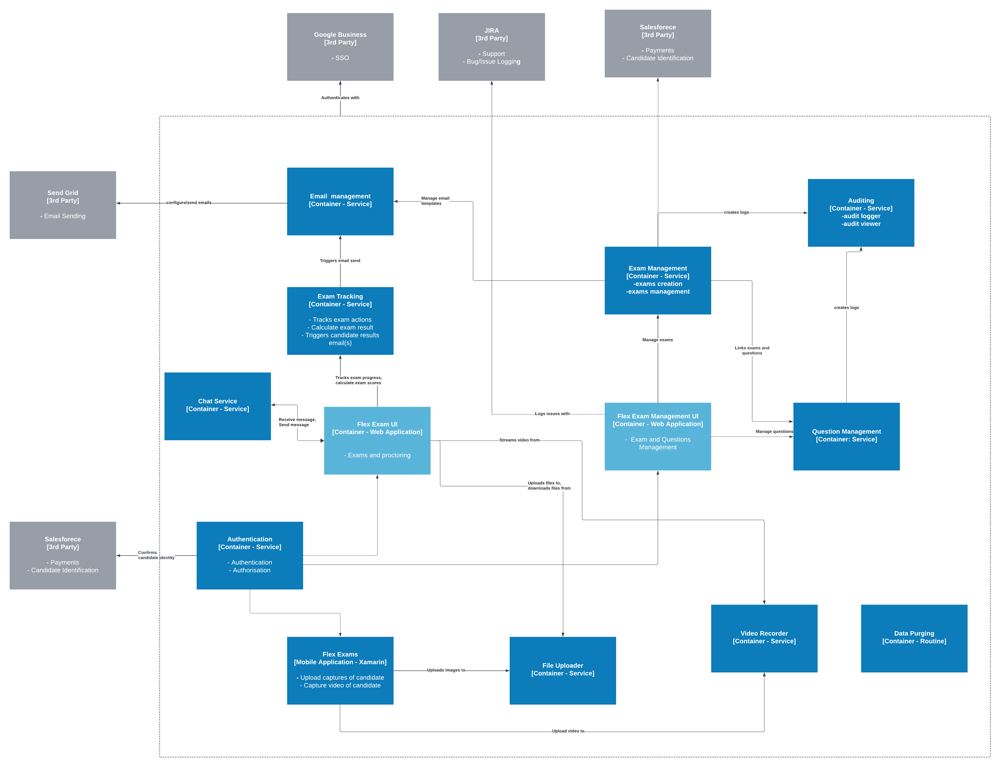

# OpenGI Katas - Flex Exams [Feb 2024]

## Contents
* [Business Case](#business-case)
* [Requirements](#requirements)
* [Architecture](#architecture)
   * [Workflows](#workflows)
   * [Context Map](#context-map)
   * [Characteristics](#characteristics)
   * [Architectural Style](#architectural-style)
   * [Architecture Decision Records](#architecture-decision-records)
   * [Architectural Principals](#architecture-principals)
   * [Architecture Diagrams](#architecture-diagrams)
   * Deployment
* Development plan
  * Development team   
  * Milestones
 
## Business Context
SSS GmbH, a prominent certification body in Germany, conducts 30,000 exams annually across various sectors. They provide FLEX EXAMS for remote testing and collaborate with Pearson VUE for Test Center Exams. Challenges with the current third-party exam system, including downtime and slow support, prompt SSS to seek a new solution. The objective is an in-house, scalable online exam system aligning with SSS's vision for robust and customizable solutions. The goal is to enhance efficiency, reliability, and business diversification.
## Requirements

_For the original requirements, please see [here](./original_requirements/original_requirements.md)_

### Functional Requirements

- **User management**: for admin users to be able to manage other system administrators and roles
- **Exam management**: for administrators to be able to create exams and preview exams
- **Question management**: for administrators to be able to create and manage exam questions, set scores, score calculations
- **Audit trail**: track changes to data with the following information: Action (created, edited, deleted), Title, Modified By, Modified On. The trail will be available for searching by each of the columns.
- **Participant registration**: register the participant in the system, integrated with a client management system
- **Identity verification**: Allow for uploading of ID documents and video recording/photographing of candidates during the exam
- **Mobile application**: A mobile application, which use of the camera, for additional security and identity checks during the exam
- **Third party integrations**: Integrations with JIRA, Google Business and Salesforce.

### Non-functional requirements

- **Localization**: Ability to easily display multiple languages
- **Branding**: The look and feel of the system should be configurable according to brand guidelines and customers branding guidelines
- **Responsiveness**: Page load times should be under 2 seconds, 5 seconds will be considered acceptable
- **Performance**: The system should support 1000 users at any time, and there should be zero downtime.
- **Modularity**: The system should be easily upgraded in the future with minimal investment
- **GDPR**: The system should be fully compliant with GDPR
- **Support**: There should be 1st level, 24/7, support

## Architecture

### Workflows

During the requirements analysis phase, we identified some key work flows by different actors within the system. These work flows are how the actors interact with the system end to end in certain scenarios and helps us map the different components of the system.

### Context Map

[TODO]

### Architectural Style

During the requirements analysis phase, we identified several architectural characteristics that are significant for the system. We grouped them into driving and implicit characteristics.

Driving and implicit characteristics are important to identify the most preferred architecture style or combination of them.

#### Driving characteristics

| Characteristic | Description |
|--|--|
| Performance | Performance is essential to provide a responsive and user friendly experience |
| Scalability | The system needs to be scalable, so that it can cope with large demand of circa 1000 users |
| Data Integrity | Data across the system must be kept correct, there must be no loss across the system to maintain integrity in the exam certificates issues. Data also includes sensitive information such as ID, so must be kept secure |
| Evolvability | The system will need to be open to new features and services to add new functionality without disrupting existing operations |

#### Implicit characteristics

| Characteristic | Description |
|--|--|
| Availability | The system must be available at all times, with 24/7 availability. The system will be multi-region meaning no downtime will be acceptable as the system must be accessable world-wide at all times |
| Changeability | The system needs to be easy to add to later on, as well as be easy to customise so that the branding of SSS can be used across the platform |
| Security | Parts of the system need to be secure and whitelisted to certain people only as well as keeping secure user data  |

#### Decision

The team picked three of the most important characteristics, Configurability, Performance and Scalability and came to the conclusion that an **event-driven architecture** would best suit the system. This would allow for features to be easily added, the system to be very scalable and to perform well.

### Architecture Decision Records

- [**ADR-1**](./adrs/1_architecture.md) - Use Event-Driven Microservices Architecture
- [**ADR-2**](./adrs/2_micro_frontends.md) - Use Micro Front-Ends for the Web Applications
- [**ADR-3**](./adrs/3_Message_Service.md)  - Use Message Service for Event Driven Architecture
- [**ADR-4**](./adrs/4_CDN.md) - Use Cloud Content Delivery Network
- [**ADR-5**](./adrs/5_Kubernetes.md) - Use Kubernetes to Deploy and Run Microservices

### Architectural Principals
- **Cloud native** - design the system  to take full advantage of the cloud. 
- **Design for scale** - when designing systems, think about scalability by breaking down components for flexible growth. Use scalable technologies and consider asynchronous design for better performance.
- **Automate everything** - prioritize automation by incorporating it seamlessly into the core design. Ensure the system is built with automation in mind from the beginning, covering automated builds, deployments, testing, monitoring, and alerting.
- **APIs are potential products** - develop APIs with the mindset of creating valuable products. Consider customer needs, emphasize user experience, and ensure ease of use, for external consumers and internal systems or developers.
- **Strategic Adaptability** - build adaptable solutions, balancing innovation with a careful consideration of potential dependencies, customizing the design to benefit from the chosen technology.
- **Zero-downtime deployments** - ensure smooth deployments with zero downtime. 
- **Secure by design** - prioritize security integration from the beginning. Incorporate security as a fundamental part of the development process.

### Architecture Diagrams
In order to visualize, describe and communicate the software architecture  for the system, we will use C4 model. In  ubiquitous language for the C4 diagrams, software system is made up of one or more containers (applications and data stores), each of which contains one or more components, which in turn are implemented by one or more code elements (classes, interfaces, objects, functions, etc).More info for the C4 Modelling approach can be find [here]([./original_requirements/original_requirements.md](https://c4model.com/)https://c4model.com/)_

#### Level 1 - System Context diagram

*A System Context Diagram is a visual representation at a high level, ilustrating a system or software application within its broader context. It shows the interactions between the system and external parts, like  users, other systems, thirt party integrations or data sources.*

The system has many-many integration points:
 * User(proctor, admin user or candidate) that interacts with the system through the web application in the browser or through the mobile application.
 * Google Business to verify the identity of the user who logs into the application
 * Jira - provides the ability for support contact in case of any issues with the system
 * Send Grid - used to build email template and send emails
 * Salesforce - enables the identification and validation of candidates applying for exams

#### Level 2 - Container diagram
*The Container diagram illustrates the overall structure of the software architecture and the distribution of responsibilities within it.*

User integration with the system is facilitated through two web applications: *Flex Exam Management UI*, *Flex Exam UI*, and a *mobile application*.
We will use Xamarin as cross platform for building Android and iOS apps, as the mobile application will not have demanding user interaction, will be used for video recording mostly.
To create and manage questions and exams, we are introducing *Exam Management* and *Question Management Services*. These services will store logs for user actions using the *Auditing Service*, which is responsible for both storing and displaying the logs.
*Exam Tracking* service is responsible for taking and monitoring Exams. It will interact with the *Video recorder* service to enable video streming during the exams and storing the recordings.
*File uploader* will stores the user identification documents, and  have *Data Purging* will make sure that all the user realted data is deleted after defined time.

#### Level 3 -Component diagram 
*The Component diagram shows how a container is made up of a number of "components", what each of those components are, their responsibilities and the technology/implementation details.*

**Question and exam management**

We are introdusing two micro frontends for the question and exam management flows.The micro front ends will comunicate with the Exam Management API and Question Management API. Each of the microservices will have separate databases.Exam and Question management will adding  message with audit information
to the message queue. Auditing microservice will be a consumer of the message queue and will get the messages, process it and store in the database.  

**Email sending**
We have established two separate flows in this container, creating the email template and sending the email.
The email creation flow  begins with the Flow Exam Management UI, showcasing the Email Management micro front end. This front end is designed to facilitate the admin user's interaction with the interface, enabling them to generate email templates. The Email Management API receives these templates from the micro front end and stores them in the database.
On the other hand, the email sending process commences with the Flex Exam UI, which features the Exam Micro front end. This component is responsible for presenting an optimal user interface to candidates while they take the exam. Once a candidate completes the exam, the front end invokes an endpoint from the Exam Tracking API, which undertakes the task of calculating the score. Email Tracking is communicate with the Email Managment API resposible for sending messages with the email template filled with content to the message queue. The system incorporates a function that leverages integration with SendGrid as a third-party provider to send the emails.

**Video Stream**
Video Streaming intoduces two micro front ends, one for the candidates and one for the proctors. Video processing microservice, is responsible for encoding and processing the video that comes from the micro frontends and mobile applications and sending Just in time encoded video direct to the media streamer. Encoded videos will be uploaded to Blob Storage to be saved. We will use Cloud content Streaming service to get the uploaded videos and sends it to cloud CDN.

**Chat Service**

**File uploader**

